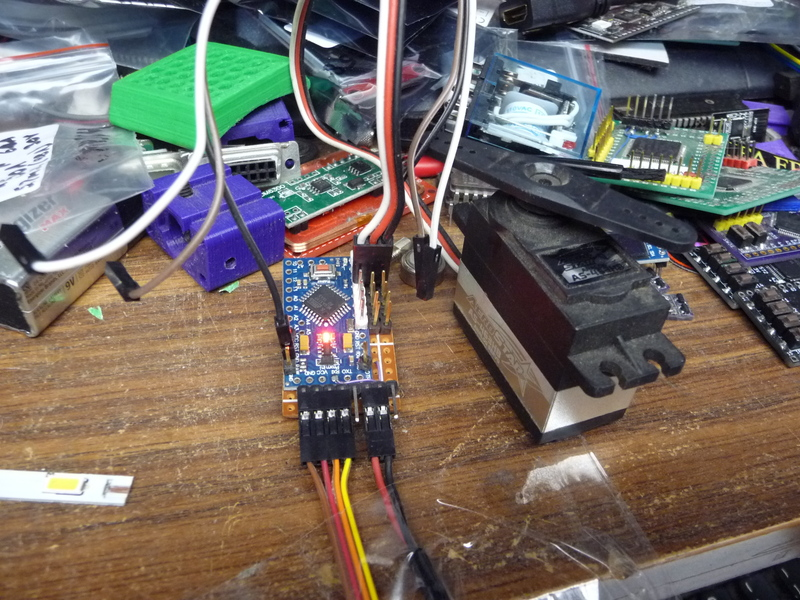
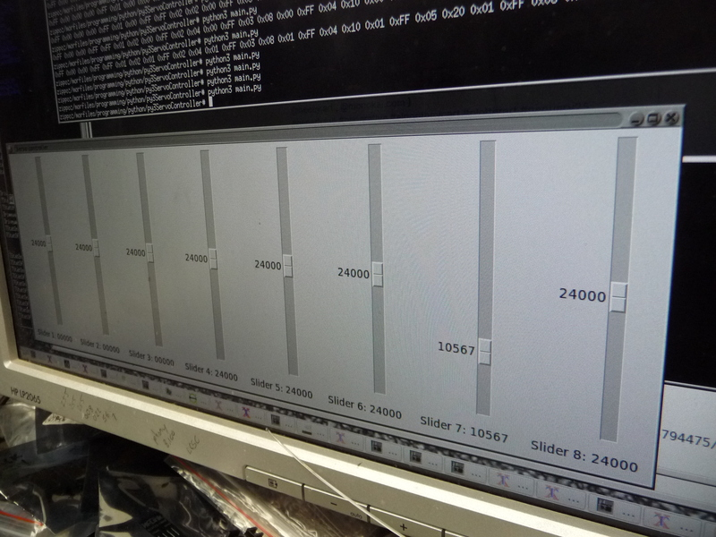

# servosliders
python3 Tk gui for operating my avr based servo controller code.

This is rev1 code, I might expand it in all sorts of ways.

Most important is the servoarray library, as I have decided that 
python is a good way to control arrays of devices based on arrays
of inputs n stuff.
